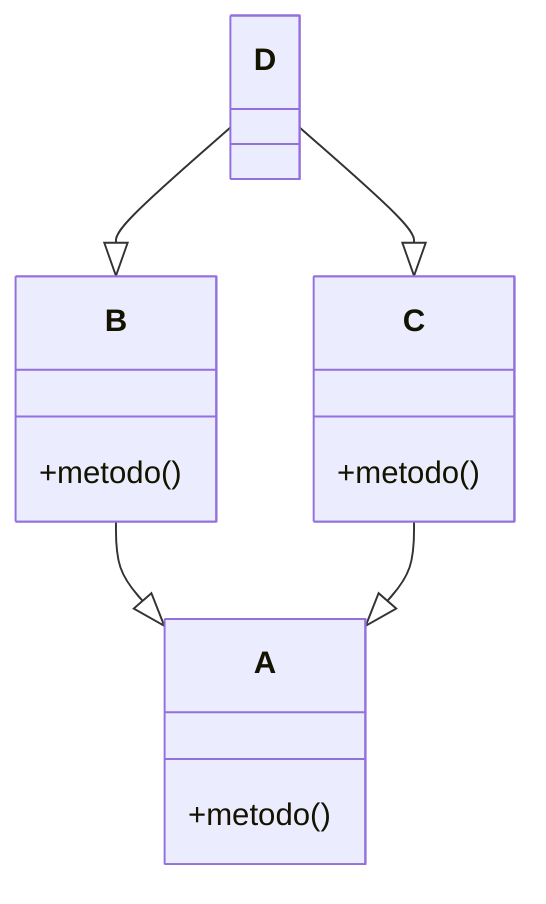

```mermaid
classDiagram
    class A {
        +metodo()
    }

    class B {
        +metodo()
    }

    class C {
        +metodo()
    }

    class D

    B --|> A
    C --|> A
    D --|> B
    D --|> C

```
